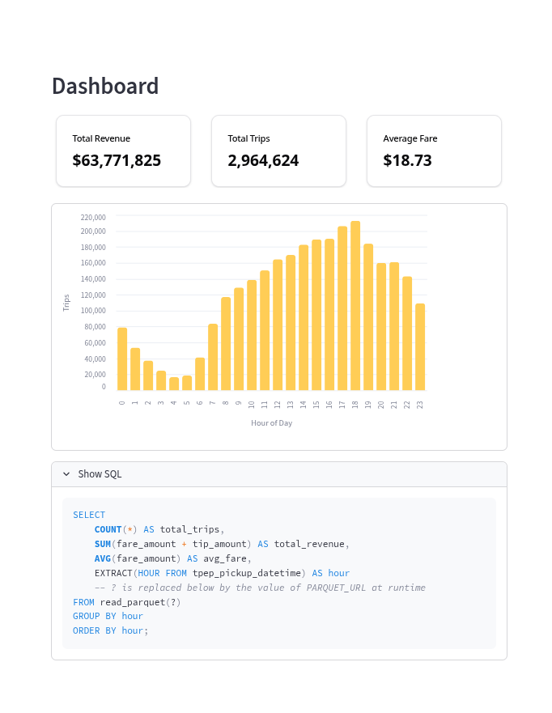

# Taxi EDA

## Overview

This project demonstrates a ~~comprehensive~~ **streamlined** data analysis and visualization workflow:

- **Acquisition** — Ingesting ~3 million [NYC TLC taxi trip records](https://www.nyc.gov/site/tlc/about/tlc-trip-record-data.page) in **`.parquet`** format
- **Exploration** — Performing EDA in **`Jupyter Notebook`** using **`SQL`** and **`Python`**
- **Presentation** — Building an interactive **`Streamlit`** dashboard using **`SQL`** and **`Python`**

## Results

