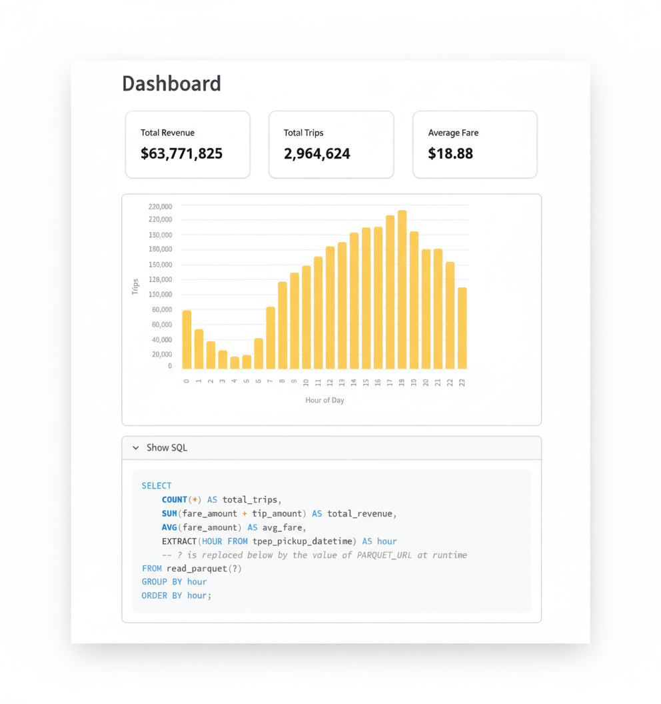

# Taxi EDA

## Overview

This project demonstrates a focused data analysis and visualization workflow:

- **Acquisition** — Ingesting ~3 million [NYC TLC taxi trip records](https://www.nyc.gov/site/tlc/about/tlc-trip-record-data.page) in `.parquet` format
- **Exploration** — Performing EDA using `SQL` and `Python` in a [Jupyter Notebook](./notebooks/analysis.ipynb)
- **Presentation** — Building an interactive dashboard with Streamlit to surface insights

## Results

  <em>
Streamlit Dashboard
</em>

## Skills Demonstrated

This project shows my ability to:

- Dive into large raw datasets and extract value
- Use familiar tools for both analysis and application
- Deliver visualization and bridging the gap between data and decision-making
- Communicate clearly: raw data → insights → actionable output

